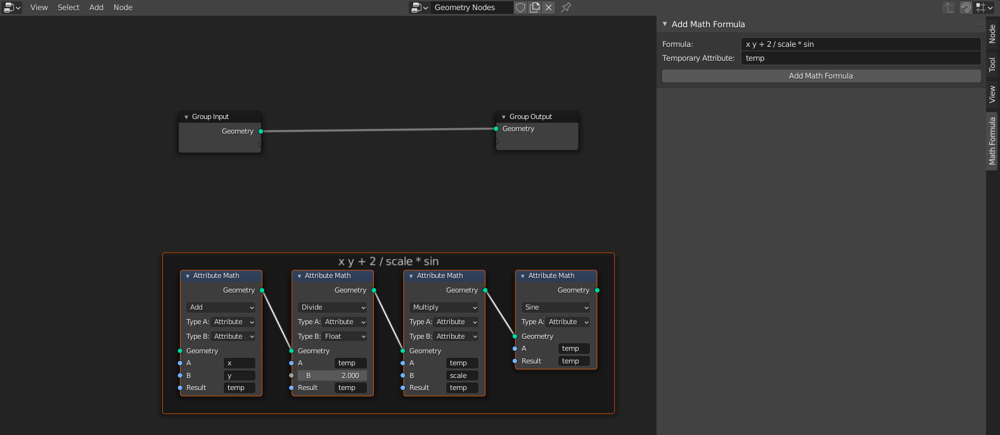

# Blender-Add-ons
This contains multiple free to use add-ons for blender.
Just open one of the files and download it.
You can also copy-paste the code into the blender text-editor to test out the script there.
Feel free to report issues or to make pull requests.

## L-system
Generate a fractal structure based on Lindenmayer systems. See https://en.wikipedia.org/wiki/L-system for some examples.

## Supershape
Generate a 3D model based on the "Superformula", usefull to create some abstract objects.

## Times Table
Generate a nice pattern. Adapted from Mathologer's video: https://www.youtube.com/watch?v=qhbuKbxJsk8.

## View Finder
A helper add-on to speed up the process of finding the best values for your current node setup.
Current features:
- Generate a 2D or 3D scene for comparing values.
- Generate a sequence of images for different values of a node input socket.

## Math Formula
- For geometry nodes only!
- Type in a formula in reverse polish notation, and then automatically add in attribute math nodes
- Anything that is not a function is seen as an argument
### Example formula
```x y + 2 / scale * sin```




