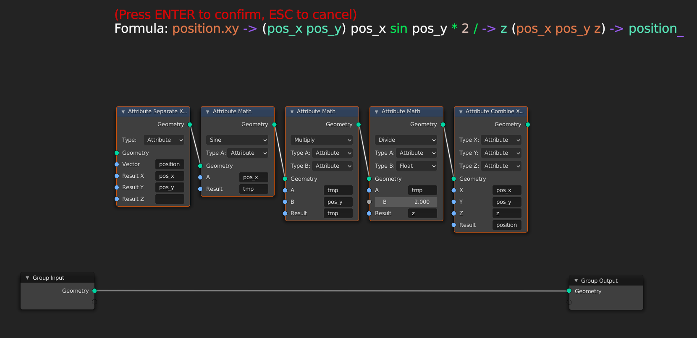

# Blender-Add-ons
This contains multiple free to use add-ons for blender.
Just open one of the files and download it.
You can also copy-paste the code into the blender text-editor to test out the script there.
Feel free to report issues or to make pull requests.

## L-system
Generate a fractal structure based on Lindenmayer systems. See https://en.wikipedia.org/wiki/L-system for some examples.

## Supershape
Generate a 3D model based on the "Superformula", usefull to create some abstract objects.

## Times Table
Generate a nice pattern. Adapted from Mathologer's video: https://www.youtube.com/watch?v=qhbuKbxJsk8.

## View Finder
A helper add-on to speed up the process of finding the best values for your current node setup.
Current features:
- Generate a 2D or 3D scene for comparing values.
- Generate a sequence of images for different values of a node input socket.

## Math Formula
- For geometry nodes only!
- Type in a formula in reverse polish notation, and then automatically add in attribute (vector) math nodes
- You can also open a menu with `SHIFT + F`, and type there. Change the shortcut in the addon preferences. This adds the nodes at the cursor location.
- If the operation is a vector math operation that is also a math operation, prefix it with "v" (example `v+`, `vadd`). One exception is `scale`, which you have to call using `vscale`, because `scale` is an internal attribute that is already used.
- Use `{}[]` to visually group things together (these are ignored)
- Make a vector using `()` (ex: `(2 4 5.7)`)
- Combine XYZ by making a vector with strings. Example: `(1 attr1 attr2)` will make a Combine XYZ node with the corresponding inputs
- Separate XYZ by ending the attribute name with `.xyz`, if you only need some of them, you can add just those. Example: `position.xy` will make a Separate XYZ node with the x and y components extracted to the attributes `x` and `y`.
- Set the name of the result of the previous attribute with `-> attribute_name`. If the previous node was a Separate XYZ then you can do syntax like: `-> (pos_x pos_y pos_z)` to set the three resulting attributes.
### Example formulas
```(1 1 1){[x y + 2 /] [position length]*} vscale vsin -> position```


```position.xy -> (pos_x pos_y) pos_x sin pos_y * 2 / -> z (pos_x pos_y z) -> position```




